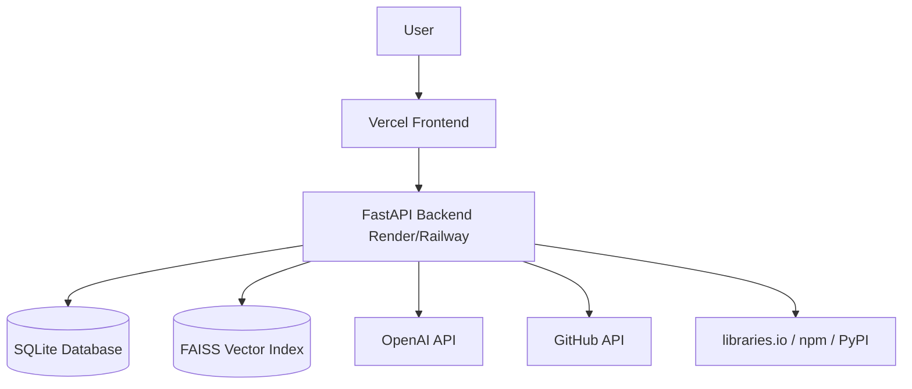

# Graveyard Mining Implementation Plan

## Goal Description
Build an AI-powered project planning assistant called "Graveyard Mining." Instead of just generating standard roadmaps, this platform discovers similar abandoned GitHub repositories, analyzes their failure reasons, and injects proactive risk checkpoints into the user's project roadmap. The MVP will include GitHub discovery, abandonment scoring, AI failure diagnosis, clustering, dependency health checking, and an annotated roadmap generator.

> [!NOTE]
> The system aims to provide evidence-based signals rather than certainties, answering the question: "What should I avoid building, and why?"

## User Review Required
> [!IMPORTANT]
> **API Keys and Secrets**: This project requires multiple external APIs. You will need to provide:
> - GitHub Personal Access Token (for the GitHub REST/GraphQL API)
> - OpenAI API Key (for GPT and Embeddings)
> Please confirm if you have these ready for the development phase.

## Final Technical Decisions

### Database & Storage (MVP)
- **Structured Data**: SQLite
  - Stores: Repository Metadata, Diagnoses, Failure Categories, Dependency Reports, Roadmaps
- **Vector Search**: FAISS (In-Memory)
  - Stores: Diagnosis Embeddings
  - **Workflow**: LLM Diagnosis -> Embedding Model -> Generate Vector -> Store in FAISS -> Store metadata in SQLite.
- *Future Upgrade*: PostgreSQL + pgvector (Supabase)

### AI Models (OpenAI Standardized)
- **gpt-4o-mini**: Used for Repository diagnosis, Failure reasoning, Cluster naming, Roadmap generation, and Risk annotation. (Fast, cost-effective, high-quality structured JSON).
- **text-embedding-3-small**: Used for Repository diagnosis embeddings, Similarity search, and Clustering. (Low cost, high quality).

### Local Development
- **Frontend**: Next.js (localhost:3000)
- **Backend**: FastAPI (localhost:8000)
- **Database**: SQLite & FAISS
- *Note*: Docker is not required for the MVP. This is the fastest setup.

### Deployment Architecture
- **Frontend**: Vercel (Zero-config, Next.js optimized)
- **Backend**: Render / Railway (Easy FastAPI deployment, simple env variables)
- **Database**: SQLite (MVP) -> Supabase PostgreSQL (Production)
- **Environment Variables**: Managed via `.env`
- **Performance**: Cache expensive GitHub and LLM responses to improve demo reliability.

## Proposed Architecture

### Tech Stack Summary
- **Frontend**: Next.js, React, TypeScript, TailwindCSS, shadcn/ui, React Flow, Framer Motion, Recharts
- **Backend**: Python, FastAPI, SQLAlchemy, Pydantic, AsyncIO
- **Database**: SQLite + FAISS
- **AI**: OpenAI `gpt-4o-mini` & `text-embedding-3-small`, HDBSCAN (or K-Means)

### Modules
1. **Discovery Engine**: GitHub Search API for similar repos.
2. **Repository Triage**: Abandonment scoring (last commit, issue ratio, etc.).
3. **Repository Data Collector**: Lightweight metadata collection (no cloning).
4. **Failure Diagnosis Engine**: LLM analyzes README, commits, and issues for failure reasons.
5. **Embedding Engine**: Converts diagnosis text into embeddings.
6. **Knowledge Clustering**: Groups repositories using HDBSCAN.
7. **Dependency Health Scanner**: Checks library health via npm/PyPI/GitHub.
8. **Roadmap Generator**: AI-generated phase-based roadmap.
9. **Risk Annotation Engine**: Attaches failure knowledge to the roadmap.
10. **Dashboard**: Unified UI for insights.

## Proposed Changes / Folder Structure

### Backend (`/backend`)
We will initialize a FastAPI Python project.
#### [NEW] `backend/app.py`
#### [NEW] `backend/requirements.txt`
#### [NEW] `backend/api/routes.py`
#### [NEW] `backend/services/github_service.py`
#### [NEW] `backend/services/repo_triage.py`
#### [NEW] `backend/services/analyzer.py`
#### [NEW] `backend/services/embeddings.py`
#### [NEW] `backend/services/clustering.py`
#### [NEW] `backend/services/dependency_checker.py`
#### [NEW] `backend/services/roadmap_generator.py`
#### [NEW] `backend/services/risk_engine.py`
#### [NEW] `backend/models/models.py` (SQLAlchemy models)
#### [NEW] `backend/schemas/schemas.py` (Pydantic schemas)

### Frontend (`/frontend`)
We will initialize a Next.js frontend with Tailwind and shadcn/ui.
#### [NEW] `frontend/package.json`
#### [NEW] `frontend/app/page.tsx`
#### [NEW] `frontend/components/Dashboard.tsx`
#### [NEW] `frontend/components/Roadmap.tsx`
#### [NEW] `frontend/components/DependencyHealth.tsx`

## Implementation Phases

### Phase 1: Project Setup
- Initialize FastAPI backend structure and dependencies.
- Initialize Next.js frontend with TailwindCSS and shadcn/ui.
- Setup SQLite database and SQLAlchemy models.

### Phase 2: Core Backend Services (Discovery & Triage)
- Implement `github_service.py` to search and collect repository data.
- Implement `repo_triage.py` to calculate the Abandonment Score.
- Implement API endpoints for testing these services.

### Phase 3: AI & Analysis Engines
- Implement `analyzer.py` using OpenAI `gpt-4o-mini` to diagnose failure reasons.
- Implement `embeddings.py` using `text-embedding-3-small` and `clustering.py` to group failure patterns with FAISS.
- Implement `dependency_checker.py` to check library health.

### Phase 4: Roadmap & Risk Integration
- Implement `roadmap_generator.py` to generate the project plan.
- Implement `risk_engine.py` to inject failure knowledge into the roadmap.
- Expose the main `/api/analyze` orchestration endpoint.

### Phase 5: Frontend Dashboard
- Build the main dashboard UI.
- Integrate with backend APIs.
- Visualize the roadmap (React Flow), dependency health, and failure clusters (Recharts).

## Verification Plan

### Automated Tests
- Unit tests for scoring algorithms (Abandonment Score).
- Mocked GitHub API tests to ensure rate limiting and error handling work.
- Validation of JSON outputs from the LLM.

### Manual Verification
- **End-to-End Test**: Submit a sample project (e.g., "AI Resume Builder", Stack: "Next.js, FastAPI, PostgreSQL") and verify the returned roadmap contains relevant abandoned repositories and risk annotations.
- **UI/UX**: Ensure the dashboard is responsive and clearly distinguishes between healthy and risky phases.
