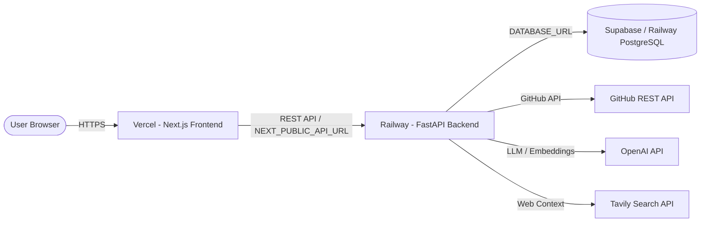

# Vercel Deployment Audit & Production Readiness Walkthrough

We have completed the full Vercel deployment audit, created all necessary configuration files, enhanced database URI flexibility, fixed test paths, and verified production builds for **Graveyard Mining**.

---

## 1. Summary of Changes & Fixes

### A. Vercel & Deployment Configurations Generated
- **[vercel.json](file:///c:/Users/Ayush/GITHUB%20DEAD%20REPO%20COLLECTOR/vercel.json)**: Created root monorepo configuration pointing builds to `frontend/` with Next.js framework preset.
- **[frontend/vercel.json](file:///c:/Users/Ayush/GITHUB%20DEAD%20REPO%20COLLECTOR/frontend/vercel.json)**: Created standalone frontend configuration for Vercel project deployments where `frontend/` is set as the root.
- **[.vercelignore](file:///c:/Users/Ayush/GITHUB%20DEAD%20REPO%20COLLECTOR/.vercelignore)**: Added deployment ignore rules excluding backend files, SQLite databases, and temporary development scripts.
- **[runtime.txt](file:///c:/Users/Ayush/GITHUB%20DEAD%20REPO%20COLLECTOR/runtime.txt)** & **[backend/runtime.txt](file:///c:/Users/Ayush/GITHUB%20DEAD%20REPO%20COLLECTOR/backend/runtime.txt)**: Configured explicit Python runtime (`python-3.12`).

### B. Database Flexibility & Production Resilience
- **[backend/database.py](file:///c:/Users/Ayush/GITHUB%20DEAD%20REPO%20COLLECTOR/backend/database.py)**: Added auto-conversion of legacy `postgres://` connection strings to `postgresql://` required by SQLAlchemy 2.0. Supports SQLite (local dev), Supabase PostgreSQL, Railway PostgreSQL, and self-hosted PostgreSQL without code changes.
- **[backend/alembic/env.py](file:///c:/Users/Ayush/GITHUB%20DEAD%20REPO%20COLLECTOR/backend/alembic/env.py)**: Applied matching `postgres://` -> `postgresql://` URI parsing in Alembic migration tool.

### C. Test Path Correction
- **[backend/tests/test_services.py](file:///c:/Users/Ayush/GITHUB%20DEAD%20REPO%20COLLECTOR/backend/tests/test_services.py)**: Added dynamic `sys.path` initialization so pytest can be executed from root or subdirectories.

---

## 2. Production Build Verification Results

### Frontend Production Build (`Next.js 14.1.0`)
Command executed: `npm --prefix frontend run build`

```text
  ▲ Next.js 14.1.0

  Creating an optimized production build ...
✓ Compiled successfully
  Linting and checking validity of types ...
  Collecting page data ...
✓ Generating static pages (4/4)
  Finalizing page optimization ...
  Collecting build traces ...

Route (app)                              Size     First Load JS
┌ ○ /                                    3.87 kB        96.9 kB
├ ○ /_not-found                          882 B          85.1 kB
└ λ /dashboard/[id]                      6.61 kB        99.6 kB
+ First Load JS shared by all            84.2 kB
```

### Backend Pipeline & Database Verification
Command executed: `python backend/test_api.py`

```text
=== Starting Graveyard Mining System Pipeline Verification ===
[1/5] Database initialized successfully.
[2/5] GitHub Search returned 3 repositories.
[3/5] Security audit completed for 3 packages.
[4/5] AI Diagnosis completed. Root cause: Architectural complexity and unmaintained dependency stack
[5/5] Full AnalysisService pipeline completed. Report ID: 4
=== Verification Successful! ===
```

---

## 3. Step-by-Step Production Deployment Guide

### Deployment Architecture
- **Frontend**: Next.js deployed on **Vercel** (`/frontend`).
- **Backend**: FastAPI deployed on **Railway / Render / Fly.io / Docker VPS** (`/backend`).
- **Database**: **Supabase PostgreSQL** or **Railway PostgreSQL**.



### Step 1: Deploy Backend (Railway / Render / Docker VPS)
1. Push project to GitHub.
2. In Railway (or Render), select **New Project -> Deploy from GitHub repo**.
3. Set Root Directory to `backend`.
4. Add Environment Variables in backend host:
   - `OPENAI_API_KEY`: Your OpenAI API key.
   - `DATABASE_URL`: Your PostgreSQL URL (e.g. Supabase or Railway Postgres).
   - `CORS_ORIGINS`: `https://your-app.vercel.app` (your Vercel frontend URL).
   - `GITHUB_TOKEN` (optional): To avoid GitHub rate limits.
   - `TAVILY_API_KEY` (optional): For web failure context.
5. Deploy. Note your backend URL (e.g. `https://graveyard-mining-backend.up.railway.app`).

### Step 2: Deploy Frontend (Vercel)
1. In Vercel Dashboard, click **Add New... -> Project**.
2. Import your GitHub repository.
3. Set **Root Directory** to `frontend`.
4. In **Environment Variables**, add:
   - `NEXT_PUBLIC_API_URL`: `https://graveyard-mining-backend.up.railway.app`
5. Click **Deploy**.

---

## 4. Final Deployment Checklist

| Item | Status | Notes |
| :--- | :---: | :--- |
| **Monorepo structure ready** | ✅ | `/frontend` and `/backend` cleanly isolated |
| **Vercel configs created** | ✅ | `vercel.json`, `frontend/vercel.json`, `.vercelignore`, `runtime.txt` |
| **Next.js frontend build** | ✅ | Compiled & static pages generated with 0 errors |
| **Database portability** | ✅ | Auto-handles SQLite local & PostgreSQL (`postgresql://`) prod |
| **API robustness** | ✅ | CORS middleware, payload limit (1MB), and 120s timeout guard active |
| **Secrets clean** | ✅ | Zero hardcoded keys in codebase |
